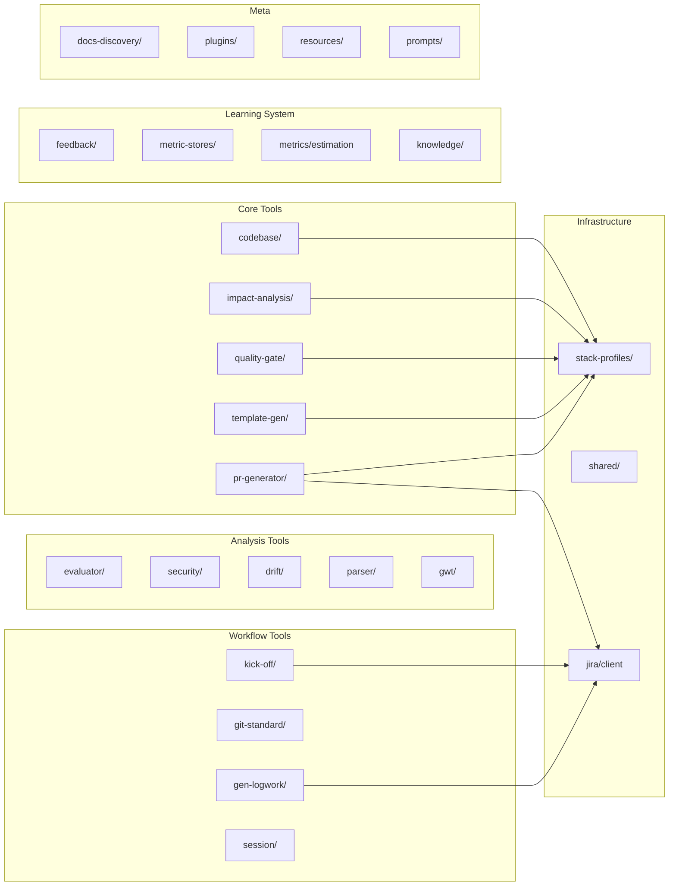

# 🔍 Phân tích Source Code: mcp-jira

## Tổng quan

**mcp-jira** là một **MCP Server (Model Context Protocol)** được xây dựng bằng TypeScript, hoạt động như một "cầu nối thông minh" giữa **AI Assistant (Claude)** và **Jira** — tự động hóa quy trình phát triển phần mềm.

> **Mục đích cốt lõi:** Cung cấp **~45 tools**, **4 prompts**, **3 resources** cho Claude Desktop/Antigravity để tự động hóa toàn bộ quy trình phát triển phần mềm — từ nhận task, phân tích, code, PR, đến logwork và feedback.

> **Cập nhật mới nhất (Kiến trúc chuẩn hóa):** Hệ thống đã hoàn thành việc chuẩn hóa 100% cơ chế xử lý lỗi tập trung (`withErrorHandler`) và điều hướng luồng làm việc tự động cho AI (`getChainHint`) trên toàn bộ 27/27 modules, giúp ngăn chặn triệt để MCP server crash và tạo ra workflow liền mạch.

---

## Kiến trúc hệ thống

```mermaid
graph TD
    A["Claude Desktop / Antigravity"] -->|stdin/stdout| B["MCP Server<br>(index.ts)"]
    B --> C["Jira Tools"]
    B --> D["Codebase Tools"]
    B --> E["Evaluator Tools"]
    B --> F["Parser Tools"]
    B --> G["Security Tools"]
    B --> H["Drift Tools"]
    B --> I["Feedback Tools"]
    B --> J["Metrics Tools"]
    B --> K["GWT Tools"]
    B --> L["Team Context Tools"]
    B --> M["Kickoff Tools"]
    B --> N["Worklog Tools"]
    B --> O2["Git Standard Tools"]
    B --> P2["PR Generator Tools"]
    B --> Q2["Session Tools"]
    B --> R2["Quality Gate Tools"]
    B --> S2["Template Gen Tools"]
    B --> T2["Impact Analysis Tools"]
    B --> U2["Estimation Tools"]
    B --> V2["Knowledge Sharing Tools"]
    B --> W2["Plugin System"]
    B --> X2["Docs Discovery Tools"]
    B --> Y2["MCP Resources"]
    B --> Z2["MCP Prompts"]
    
    C -->|REST API| O["Jira Server"]
    G -->|Claude API| P["Anthropic API"]
    I -->|JSON file| Q["feedback-store.json"]
    J -->|JSON file| R["metrics-store.json"]
    L -->|Markdown| S["TEAM_CONTEXT.md"]
    V2 -->|JSON file| KS["cross-project-knowledge.json"]
    Q2 -->|JSON files| SS[".mcp-jira/sessions/"]
    W2 -->|Dynamic JS| PP[".mcp-plugins/*.plugin.js"]
```



## Tech Stack

| Thành phần | Công nghệ |
|---|---|
| Runtime | Node.js (ESM) |
| Language | TypeScript 5.6 |
| MCP SDK | `@modelcontextprotocol/sdk` ^1.0.0 |
| HTTP Client | `axios` (Jira API), native `fetch` (Claude API) |
| Validation | `zod` ^3.23 |
| Process Exec | `child_process` (git, grep, lint, build, test) |
| Storage | JSON files (feedback, metrics, sessions, knowledge), Markdown (team context, git standard) |
| Transport | StdioServerTransport (stdin/stdout pipe) |

---

## 27 Modules — Chi tiết

### 1. 📌 `jira/` — Jira Integration (7 tools)

Giao tiếp trực tiếp với Jira REST API. Gồm 3 file: `client.ts` (Jira API wrapper), `formatter.ts` (format output), `tools.ts` (tool registration).

| Tool | Chức năng |
|---|---|
| `list_my_open_issues` | Lấy danh sách issues được assign, hỗ trợ filter (open/active/done/all) và customJql |
| `get_issue_detail` | Đọc chi tiết 1 issue (auto-check drift bằng heuristics) |
| `log_work` | Ghi nhận thời gian làm việc |
| `update_issue` | Chuyển trạng thái + comment + dryRun xem transitions |
| `create_issue` | Tạo issue/sub-task mới + dryRun xem metadata |

**Điểm đặc biệt:** `get_issue_detail` tự động tính **drift warning** (heuristic) — cảnh báo khi task cũ (>14 ngày), comments mới có keywords thay đổi requirement.

---

### 2. 🔍 `codebase/` — Codebase Reader (5 tools)

Tìm kiếm và đọc file trong codebase. Gồm 3 file: `reader.ts`, `scorer.ts`, `tools.ts`.

| Tool | Chức năng |
|---|---|
| `find_by_name` | Tìm file theo tên class/component/service |
| `search_keyword` | Tìm keyword trong toàn bộ nội dung file |
| `read_module` | Đọc toàn bộ 1 folder/module |
| `detect_files_from_task` | **Tự động** phân tích Jira task → trích keywords → tìm file liên quan |
| `rank_context_files` | Dùng Claude API để semantic-rank file theo độ liên quan |

**Điểm đặc biệt:** `detect_files_from_task` trích xuất PascalCase, camelCase, kebab-case từ description → search codebase → trả về top 8 file liên quan nhất. Sử dụng `stack-profiles/` để scoring đúng theo framework.

---

### 3. 📊 `evaluator/` — Task Complexity Evaluator (1 tool)

| Tool | Chức năng |
|---|---|
| `evaluate_task_complexity` | Thu thập data + security signals → trả về cho Claude tự đánh giá clarity, complexity, AI risk, ước tính giờ |

**Không gọi external API** — chỉ trả raw data để Claude đang chat tự phân tích.

---

### 4. 📋 `parser/` — Description Parser (2 tools)

Parse description Jira theo format chuẩn.

| Tool | Chức năng |
|---|---|
| `parse_description` | Parse `[AI_METADATA]`, scenarios GWT, `[DONE_WHEN]` checklist → structured data |
| `check_format_compliance` | Kiểm tra description có đúng template → grade A-F |

**Hỗ trợ 4 loại issue:** Task, Bug, Story, Sub-task — mỗi loại có template riêng.

---

### 5. 🔐 `security/` — Security Analysis (2 tools)

Phát hiện vùng nhạy cảm bảo mật trong task.

| Tool | Chức năng |
|---|---|
| `check_security_flag` | Phân tích keywords → detect 7 security domains → trả về flag level (CRITICAL/HIGH/MEDIUM/NONE) |
| `security_review_checklist` | Gọi Claude API → sinh checklist bảo mật cụ thể cho task |

**7 Security domains:** Authentication, Authorization, Token Management, Sensitive Data (PII), XSS Risk, Input Validation, API Integration.

---

### 6. 🔄 `drift/` — Description Drift Detection (2 tools)

Phát hiện requirement đã thay đổi qua comments nhưng description chưa cập nhật.

| Tool | Chức năng |
|---|---|
| `check_description_drift` | Phân tích signals: tuổi task, comments mới, keywords thay đổi → drift score |
| `extract_latest_requirements` | Đọc description + TẤT CẢ comments → trả về cho Claude tổng hợp requirement thực tế |

---

### 7. 📝 `feedback/` — Feedback Loop (3 tools)

Hệ thống học hỏi theo thời gian — lưu feedback sau mỗi task.

| Tool | Chức năng |
|---|---|
| `submit_task_feedback` | Ghi feedback: code quality, estimation accuracy, what worked/failed, tribal knowledge |
| `get_feedback_insights` | Phân tích patterns: lỗi lặp lại, estimation bias, loại task AI tốt/kém |
| `list_feedback_history` | Xem lịch sử feedback, filter theo tag/thời gian |

**Storage:** `feedback-store.json` — local JSON file.

---

### 8. 📈 `metric-stores/` — Quantitative Metrics (3 tools)

Track ROI thực tế của hệ thống AI — khác feedback (định tính), metrics là **định lượng**.

| Tool | Chức năng |
|---|---|
| `track_metric` | Ghi cycle time, AI revision rate, estimation accuracy, security/drift issues |
| `get_metrics_report` | Báo cáo tổng quan: success rate, avg quality, sprint comparison |
| `get_metrics_dashboard` | Render HTML dashboard với Chart.js — visualize trực quan |

**Storage:** `metrics-store.json` — local JSON file.

---

### 9. ✍️ `gwt/` — GWT Description Generator (2 tools)

Cải thiện description mơ hồ thành format Given/When/Then chuẩn.

| Tool | Chức năng |
|---|---|
| `generate_gwt_description` | Trả về description + hướng dẫn để Claude tự sinh GWT |
| `validate_description_quality` | Trả về description + prompts để Claude chấm điểm specificity, completeness, testability |

---

### 10. 📚 `team-context/` — Tribal Knowledge Manager (2 tools)

Quản lý kiến thức ngầm định (tribal knowledge) của team.

| Tool | Chức năng |
|---|---|
| `get_team_context` | Đọc `TEAM_CONTEXT.md` — auto-filter sections liên quan theo task description |
| `update_team_context` | Thêm entry mới vào file (API gotchas, forbidden patterns, workarounds...) |

**11 sections:** SERVICE_RULES, API_GOTCHAS, FORBIDDEN_PATTERNS, PREFERRED_PATTERNS, NAMING_CONVENTIONS, KNOWN_ISSUES, TEMPORARY_WORKAROUNDS, SECURITY_RULES, TESTING_RULES, DEPENDENCIES, TEAM_GLOSSARY.

---

### 11. 🚀 `kick-off/` — Task Kickoff Wizard (1 tool)

| Tool | Chức năng |
|---|---|
| `task_kickoff` | **Entry point cho mọi task.** Đọc Jira → phân tích nhanh (drift, security, format) → trả về bộ câu hỏi có cấu trúc để Claude hỏi user tuần tự |

User chỉ cần nói _"làm task PROJ-123"_ — tool lo phần còn lại.

---

### 12. 📝 `gen-logwork/` — Worklog Generator (1 tool)

| Tool | Chức năng |
|---|---|
| `generate_worklog` | Tự động sinh nội dung logwork từ: `[DONE_WHEN]` checklist, scenario names, file đã sửa gần đây, WHERE context. **Không gọi AI API.** |

---

### 13. 📐 `git-standard/` — Git Convention Manager (3 tools) ⭐ NEW

Quản lý quy chuẩn Git — tìm file `GIT_STANDARD.md` trong project hoặc fallback về default của MCP.

| Tool | Chức năng |
|---|---|
| `get_git_standard` | Đọc quy chuẩn Git (commit, branch, workflow), ưu tiên project-level rồi fallback MCP default |
| `suggest_branch_name` | Sinh gợi ý tên branch theo chuẩn Conventional: `feature/PROJ-123-add-user-profile` |
| `suggest_commit_message` | Sinh commit message theo Conventional Commits: `feat(auth): add login api` |

**Includes:** Slug generator hỗ trợ tiếng Việt (diacritics removal, `đ → d`).

---

### 14. 🔀 `pr-generator/` — PR Description Generator (1 tool) ⭐ NEW

| Tool | Chức năng |
|---|---|
| `generate_pr_description` | Tự động sinh PR description từ: Jira task (summary, DONE_WHEN, scenarios) + `git diff` (added/modified/deleted files) + recent commits. Output sẵn sàng paste vào PR. |

**Tích hợp:** Jira API + Git CLI + Stack Profiles.

---

### 15. 💾 `session/` — Session Context Manager (3 tools) ⭐ NEW

Lưu và khôi phục context giữa các phiên chat — giải quyết vấn đề Claude "quên" khi bắt đầu chat mới.

| Tool | Chức năng |
|---|---|
| `save_session` | Lưu context: files, decisions, notes, branch, status, security level |
| `load_session` | Khôi phục context khi user nói "tiếp tục PROJ-123" |
| `list_sessions` | Xem danh sách tất cả sessions đang active, sorted by updated time |

**Storage:** `.mcp-jira/sessions/<issueKey>.json`

**Session Data:** issueKey, summary, status (kickoff→analyzing→implementing→testing→reviewing→done), detectedFiles, decisions, notes, branchName, securityLevel.

---

### 16. ✅ `quality-gate/` — Code Quality Gate (1 tool) ⭐ NEW

| Tool | Chức năng |
|---|---|
| `check_quality_gate` | Chạy lint + build + test → gate PASS/BLOCKED. Kiểm tra trước khi close task. |

**Stack-aware commands:**
| Stack | Build | Lint | Test |
|---|---|---|---|
| Angular | `ng build --prod` / `tsc --noEmit` | `ng lint` | `ng test --browsers=ChromeHeadless` |
| React | `tsc --noEmit` | `eslint . --max-warnings=0` | `vitest run` |
| NestJS | `tsc --noEmit` | `eslint . --max-warnings=0` | `jest --passWithNoTests` |
| Spring | `mvn compile` | `mvn checkstyle:check` | `mvn test` |
| Flutter | `flutter analyze` | `dart analyze` | `flutter test` |

---

### 17. 📦 `template-gen/` — Boilerplate Generator (1 tool) ⭐ NEW

| Tool | Chức năng |
|---|---|
| `generate_template` | Sinh boilerplate code cho feature mới theo stack. Preview code trước khi tạo file. |

**Templates per stack:**
| Stack | Files sinh ra |
|---|---|
| Angular | component.ts + .html + .scss + .spec.ts, hoặc service.ts + .spec.ts |
| NestJS | controller.ts + service.ts + module.ts + dto.ts |
| React | Component.tsx + Component.test.tsx + index.ts |
| Flutter | screen.dart + bloc.dart + model.dart + repository.dart |
| Spring Boot | Controller.java + Service.java + Repository.java + Dto.java |

---

### 18. 🔍 `impact-analysis/` — Dependency Impact Analyzer (1 tool) ⭐ NEW

| Tool | Chức năng |
|---|---|
| `analyze_impact` | Phân tích reverse-import graph: file X bị sửa → ai import X → module nào bị ảnh hưởng → test nào cần chạy lại |

**Tính năng:**
- Quét N tầng dependency (configurable depth)
- Cross-platform: dùng `grep -rl` (Linux/Mac) hoặc `findstr /S /M` (Windows)
- Phân loại file: 🎨 Component, ⚙️ Service, 📦 Module, 🌐 Controller, 🧪 Test
- Cảnh báo khi impact > 10 files hoặc > 3 modules

---

### 19. 🧠 `metrics/` — Smart Estimation Engine (1 tool) ⭐ NEW

| Tool | Chức năng |
|---|---|
| `suggest_estimation` | Dự đoán thời gian hoàn thành task dựa trên lịch sử metrics thực tế (actual vs estimated) |

**Thuật toán:** Filter tasks tương tự theo issueType + tags → tính avgActual + avgRatio (actual/estimated) → suggest = baseEstimation × avgRatio, round to 0.5h. Phát hiện pattern underestimate (ratio > 1.2) hoặc overestimate (ratio < 0.8).

---

### 20. 💡 `knowledge/` — Cross-Project Knowledge Sharing (2 tools) ⭐ NEW

Chia sẻ tribal knowledge giữa các dự án khác nhau.

| Tool | Chức năng |
|---|---|
| `contribute_knowledge` | Ghi nhận kiến thức mới: gotcha, pattern, fix hiếm. Tag theo stack + impact level |
| `get_shared_knowledge` | Truy vấn kiến thức: filter theo stack, topic search, sort by impact |

**Storage:** `store/cross-project-knowledge.json`

---

### 21. 🔌 `plugins/` — Dynamic Plugin System (1 tool) ⭐ NEW

Cho phép project tự mở rộng MCP bằng cách viết thêm tools trong folder `.mcp-plugins/`.

| Tool | Chức năng |
|---|---|
| `reload_plugins` | Scan và load lại plugins từ `.mcp-plugins/` khi đang chạy |

**Plugin Interface:**
```typescript
interface McpPlugin {
  name: string;
  version: string;
  registerTools?: (server: McpServer) => void;
  registerPrompts?: (server: McpServer) => void;
  registerResources?: (server: McpServer) => void;
}
```

**Auto-load:** Server tự scan `.mcp-plugins/` khi khởi động. Hỗ trợ `.plugin.js` và `.plugin.mjs`.

---

### 22. 📚 `docs-discovery/` — Project Docs Scanner (2 tools) ⭐ NEW

Tự động quét toàn bộ tài liệu .md trong dự án, thay vì hardcode 3 file cứng.

| Tool | Chức năng |
|---|---|
| `scan_project_docs` | Quét 11 thư mục (docs/, .gemini/, rules/, .cursor/...) → phân loại (context/workflow/rule/security/architecture/guide) → sort by priority |
| `read_project_doc` | Đọc nội dung 1 file tài liệu. Có path traversal security check. |

**Categories:** 🧠 context, 🔄 workflow, 📏 rule, 🔐 security, 🏗️ architecture, 📖 guide, 📄 other.

---

### 23. 🔧 `stack-profiles/` — Framework Detection Engine (hạ tầng, không có tool)

Hệ thống phát hiện tech stack tự động từ project root. **Là infrastructure module** — các module khác (codebase, quality-gate, template-gen, impact-analysis, pr-generator) đều phụ thuộc vào nó.

**6 profiles sẵn có:** Angular 17+, Spring Boot 3.x, NestJS, Flutter, React/Next.js, Generic.

**Auto-detection** dựa trên marker files:
| Marker File | Stack |
|---|---|
| `angular.json` | Angular |
| `pubspec.yaml` | Flutter |
| `nest-cli.json` / `@nestjs/core` | NestJS |
| `pom.xml` / `build.gradle` | Spring |
| `next.config.*` / `react` in package.json | React |

**Mỗi profile chứa:** extensions, ignorePatterns, fileTypeScores, taskPatterns (keyword→file boost), langMap, promptContext, projectStructure.

---

### 24. 🛠️ `shared/` — Shared Utilities (hạ tầng, không có tool)

Tiện ích cốt lõi dùng chung cho **toàn bộ 27/27 modules** của hệ thống, cung cấp cơ chế bảo vệ server vững chắc và điều hướng luồng làm việc của AI tự động.

| Export | Chức năng |
|---|---|
| `formatToolError()` | Format lỗi thống nhất cho tất cả tools |
| `withErrorHandler()` | Wrapper try-catch an toàn áp dụng trên TOÀN BỘ handlers, chống crash MCP server |
| `getChainHint()` | Tính năng gợi ý tool tiếp theo định tuyến chính xác workflow của AI (automated tool chaining) |
| `TOOL_CHAINING` | Map cấu hình rules: tool X xong → workflow nên gợi ý gọi tool Y |

---

### 25. 📑 `resources/` — MCP Resources (3 resources) ⭐ NEW

File tĩnh mà AI có thể đọc bất cứ lúc nào mà không cần gọi tool.

| Resource | URI | Nội dung |
|---|---|---|
| `team-context` | `team://context` | TEAM_CONTEXT.md — tribal knowledge |
| `git-standard` | `git://standard` | GIT_STANDARD.md — quy chuẩn git |
| `mcp-config` | `config://mcp` | mcp-config.json — cấu hình MCP |

---

### 26. 📜 `prompts/` — Predefined Workflows (4 prompts) ⭐ NEW

Workflow templates mà AI có thể trigger. Mỗi prompt là một chuỗi tool calls có thứ tự.

| Prompt | Chức năng |
|---|---|
| `start` | Entry point — list tasks → chọn task → auto kickoff |
| `implement-task` | Full workflow: kickoff → docs scan → parse → evaluate → security → git → implement → commit |
| `review-code` | Security check → convention check → file impact → report |
| `close-task` | Logwork → status update (với resolution + comment) → feedback + metrics |

---

### 27. 📂 `docs/` — Documentation (7 files)

Tài liệu chuẩn của MCP server.

| File | Nội dung |
|---|---|
| `DESCRIPTION_TEMPLATES.md` | Template description cho Task/Bug/Story/Sub-task |
| `GIT_STANDARD.md` | Quy chuẩn Git mặc định (Conventional Commits, branch naming) |
| `GWT_TEMPLATE_GUIDE.md` | Hướng dẫn viết Given/When/Then |
| `PROJECT_SETUP.md` | Hướng dẫn cài đặt và cấu hình |
| `QUICKSTART.md` | Hướng dẫn bắt đầu nhanh |
| `SECURITY_PATTERNS.md` | 7 security domains chi tiết |
| `TEAM_CONTEXT.md` | Template TEAM_CONTEXT mặc định |

---

## Thống kê tổng quan

| Chỉ số | Con số |
|---|---|
| **Tổng tools** | ~45 |
| **MCP Resources** | 3 |
| **MCP Prompts** | 4 |
| **Modules** | 27 subdirectories |
| **Stack profiles** | 6 (Angular, Spring, NestJS, Flutter, React, Generic) |
| **Tổng dòng code** | ~5,500+ lines TypeScript |
| **Dependencies** | 4 (MCP SDK, axios, dotenv, zod) |

---

## Workflow tổng thể

```
User: "Làm task PROJ-123"
      │
      ▼
[task_kickoff] ─── Đọc Jira, phân tích nhanh, trả bộ câu hỏi
      │
      ▼
[scan_project_docs] ─── Scan docs dự án → đọc file quan trọng
      │
      ▼
[parse_description] ─── Parse description → structured data
      │
      ▼
[get_team_context] ─── Inject tribal knowledge
[get_shared_knowledge] ─── Check cross-project gotchas
      │
      ▼
[check_security_flag] ─── Nếu liên quan security → checklist
      │
      ▼
[evaluate_task_complexity] ─── Đánh giá effort, rủi ro
[suggest_estimation] ─── Ước tính giờ dựa trên metrics lịch sử
      │
      ▼
[detect_files_from_task] ─── Tìm file context tự động
[analyze_impact] ─── Hiểu phạm vi ảnh hưởng
      │
      ▼
[suggest_branch_name] ─── Gợi ý tên branch chuẩn
      │
      ▼
    IMPLEMENT
      │
      ▼
[suggest_commit_message] ─── Conventional Commits
[check_quality_gate] ─── Lint + Build + Test gate
      │
      ▼
[generate_pr_description] ─── Sinh PR description tự động
      │
      ▼
[generate_worklog] ─── Sinh nội dung logwork
[log_work] ─── Submit lên Jira
[update_issue] ─── Chuyển Done + Resolution + Comment
      │
      ▼
[submit_task_feedback] ─── Ghi feedback để học hỏi
[track_metric] ─── Track metrics định lượng
[save_session] ─── Lưu context cho phiên sau
```

---

## Đặc điểm thiết kế nổi bật

1. **"Data provider, not decision maker"** — Nhiều tools (evaluator, gwt, drift, estimation) trả về raw data + hướng dẫn cho Claude tự phân tích, thay vì gọi Claude API riêng. Tiết kiệm token và tận dụng Claude đang chat.

2. **Tự động hóa triệt để** — Từ nhận task → phân tích → tìm file → implement → commit → PR → logwork → feedback. User chỉ cần nói 1 câu.

3. **Learning loop** — Feedback + Metrics stores + Knowledge sharing cho phép hệ thống cải thiện theo thời gian. AI không lặp lại lỗi cũ.

4. **Security-first** — 7 security domains, auto-detect, sinh checklist bảo mật trước khi merge.

5. **Drift detection** — Giải quyết vấn đề thực tế: requirement thay đổi qua comments nhưng description Jira không cập nhật.

6. **Description quality gate** — Format compliance checker + GWT generator đảm bảo input chất lượng cao trước khi AI implement.

7. **Multi-stack support** — 6 stack profiles (Angular, Spring, NestJS, Flutter, React, Generic) với auto-detection. Mọi tool đều stack-aware.

8. **Session persistence** — Context được lưu giữa các phiên chat. User nói "tiếp tục PROJ-123" → AI load toàn bộ context cũ.

9. **Plugin architecture** — Project có thể tự mở rộng MCP qua `.mcp-plugins/` folder mà không cần sửa source code.

10. **Robust Tool Chaining & Error Handling** — Toàn bộ 27 module được bọc mượt mà bởi `withErrorHandler` để đảm bảo hệ thống zero-crash khi runtime. Đồng thời `getChainHint` cung cấp gợi ý "bước tiếp theo (next step)" một cách chủ động theo ngữ cảnh sau mỗi tool call, mang tới workflow tự nhiên, không bị gián đoạn cho AI.

11. **Full Git workflow** — Từ đọc quy chuẩn → suggest branch → suggest commit → generate PR → quality gate. Đầy đủ chuỗi giá trị.

12. **Predefined prompts** — 4 workflow templates (start, implement-task, review-code, close-task) cho phép user trigger cả chuỗi chỉ bằng 1 prompt name.

---

## Sơ đồ dependency giữa modules


