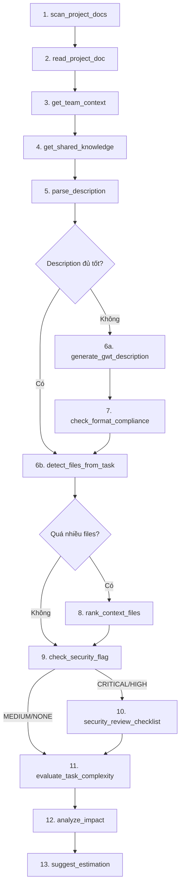

# 🚀 Hướng dẫn Workflow tối ưu cho mcp-jira MCP

> **Mục đích:** Hướng dẫn người dùng (developer) cách sử dụng MCP Server theo đúng thứ tự để xây dựng context đầy đủ nhất, giúp AI hoàn thành task nhanh và chính xác nhất.

---

## Tổng quan: 5 giai đoạn chính

```
🏁 KHỞI TẠO → 🧠 THU THẬP CONTEXT → ⚡ IMPLEMENT → 🔍 REVIEW & CLOSE → 📈 HỌC HỎI
```

Mỗi giai đoạn gồm các tool cần gọi theo thứ tự. AI sẽ tự gợi ý bước tiếp theo nhờ `getChainHint`, nhưng nắm rõ workflow giúp bạn chủ động hơn.

---

## Giai đoạn 1: 🏁 Khởi tạo task

> **Mục tiêu:** AI hiểu bạn muốn làm gì, task nào, ở đâu.

### Cách nhanh nhất (Khuyến nghị)

Chỉ cần nói:

```
Làm task GOCONNECT-1260
```

AI sẽ tự gọi `task_kickoff` → hỏi bạn 4 câu hỏi:

1. **Mục tiêu** — Implement đầy đủ hay chỉ phân tích?
2. **Description** — Cần bổ sung GWT hay dùng luôn?
3. **Nhánh git** — Tạo mới hay dùng nhánh có sẵn?
4. **Project root** — Đường dẫn codebase (nếu chưa cung cấp)

### Cách thay thế (dùng prompt có sẵn)

```
/implement-task issueKey=GOCONNECT-1260 projectRoot=D:/projects/goconnect
```

Prompt `implement-task` sẽ hướng dẫn AI chạy toàn bộ pipeline tự động.

### ⚠️ Cảnh báo tự động

`task_kickoff` sẽ phát hiện và cảnh báo:

| Loại | Điều kiện |
|---|---|
| **Drift risk** | Task > 14 ngày + có comments thay đổi requirement |
| **Security concern** | Description chứa keywords auth/token/password |
| **Poor description** | Thiếu sections chuẩn (< 4/6) hoặc 0 scenarios |

---

## Giai đoạn 2: 🧠 Thu thập context (QUAN TRỌNG NHẤT)

> **Mục tiêu:** Cung cấp cho AI toàn bộ kiến thức cần thiết TRƯỚC KHI code.
>
> ⭐ **Đây là giai đoạn quyết định chất lượng output.** Càng nhiều context chính xác → AI code càng đúng.

### Thứ tự khuyến nghị



### Chi tiết từng bước

#### Bước 2.1 — Hiểu dự án (chỉ cần lần đầu)

| # | Tool | Mục đích | Khi nào bỏ qua |
|---|---|---|---|
| 1 | `scan_project_docs` | Quét docs dự án → biết có tài liệu gì | Đã biết rõ dự án |
| 2 | `read_project_doc` | Đọc file architecture, code standards | Đã đọc trước đó |
| 3 | `get_team_context` | Inject tribal knowledge (forbidden patterns, API gotchas) | File TEAM_CONTEXT.md chưa có |
| 4 | `get_shared_knowledge` | Check kiến thức từ project khác cùng stack | Chỉ có 1 project |

#### Bước 2.2 — Hiểu task

| # | Tool | Mục đích | Khi nào bỏ qua |
|---|---|---|---|
| 5 | `parse_description` | Parse description → structured data (metadata, scenarios, checklist) | Description quá ngắn |
| 6a | `generate_gwt_description` | AI sinh lại description chuẩn GWT | Description đã đủ tốt |
| 6b | `check_format_compliance` | Chấm điểm description (grade A-F) | Chỉ cần nếu muốn cải thiện |

#### Bước 2.3 — Hiểu code

| # | Tool | Mục đích | Khi nào bỏ qua |
|---|---|---|---|
| 7 | `detect_files_from_task` | Tự động tìm file liên quan từ keywords trong description | Biết chính xác file cần sửa |
| 8 | `rank_context_files` | Dùng Claude API semantic-rank nếu quá nhiều file | ≤ 5 files |

#### Bước 2.4 — Đánh giá rủi ro

| # | Tool | Mục đích | Khi nào bỏ qua |
|---|---|---|---|
| 9 | `check_security_flag` | Phát hiện vùng nhạy cảm bảo mật | Task UI thuần, không liên quan auth |
| 10 | `security_review_checklist` | Sinh checklist bảo mật | Chỉ khi flag = CRITICAL/HIGH |
| 11 | `evaluate_task_complexity` | Đánh giá effort, rủi ro AI | Task rất đơn giản |
| 12 | `analyze_impact` | File X bị sửa → ai bị ảnh hưởng | Task sửa ≤ 1 file |
| 13 | `suggest_estimation` | Ước tính giờ từ lịch sử metrics | Chưa có metrics data |

---

## Giai đoạn 3: ⚡ Implement

> **Mục tiêu:** Viết code với full context đã thu thập.

### Thứ tự

```
get_git_standard → suggest_branch_name → Tạo branch
       ↓
   IMPLEMENT CODE (AI viết code dựa trên context)
       ↓
check_quality_gate → suggest_commit_message → Commit
```

| # | Tool | Mục đích |
|---|---|---|
| 1 | `get_git_standard` | Đọc quy chuẩn Git của project |
| 2 | `suggest_branch_name` | Gợi ý tên branch chuẩn Conventional |
| 3 | _Tạo branch + Implement_ | AI viết code |
| 4 | `check_quality_gate` | Chạy lint + build + test → gate PASS/BLOCKED |
| 5 | `suggest_commit_message` | Gợi ý commit message Conventional Commits |
| 6 | `generate_template` | _(Tùy chọn)_ Sinh boilerplate nếu tạo feature mới |

---

## Giai đoạn 4: 🔍 Review & Close task

> **Mục tiêu:** Tạo PR, logwork, đóng task trên Jira.

### Thứ tự

```
generate_pr_description → Tạo PR
       ↓
generate_worklog → log_work → update_issue (Done + Resolution + Comment)
```

| # | Tool | Mục đích |
|---|---|---|
| 1 | `generate_pr_description` | Sinh PR description từ Jira + git diff + commits |
| 2 | `generate_worklog` | Sinh nội dung logwork từ checklist + files đã sửa |
| 3 | `log_work` | Submit logwork lên Jira |
| 4 | `update_issue` | Chuyển Done/Resolved + Resolution + Comment |

### Hoặc dùng prompt có sẵn

```
/close-task issueKey=GOCONNECT-1260 timeSpent=2h projectRoot=D:/projects/goconnect
```

---

## Giai đoạn 5: 📈 Học hỏi & Lưu context

> **Mục tiêu:** Hệ thống cải thiện theo thời gian.

| # | Tool | Mục đích |
|---|---|---|
| 1 | `submit_task_feedback` | Ghi nhận: AI code tốt/kém, file nào hữu ích, gì cần cải thiện |
| 2 | `track_metric` | Track định lượng: cycle time, AI revision count, estimation accuracy |
| 3 | `save_session` | Lưu context (files, decisions, notes) cho phiên chat sau |
| 4 | `contribute_knowledge` | _(Tùy chọn)_ Chia sẻ gotcha/pattern mới cho các project khác |

**Tip:** Khi quay lại task đã lưu, nói: _"tiếp tục GOCONNECT-1260"_ → AI gọi `load_session` tự động load toàn bộ context cũ.

---

## 📌 Tóm tắt nhanh — Workflow tối thiểu (5 phút)

Nếu muốn nhanh nhất, chỉ cần 5 tool calls:

```
1. task_kickoff          ← Hiểu task + cảnh báo rủi ro
2. get_team_context      ← Inject tribal knowledge
3. detect_files_from_task ← Tìm file liên quan
4. suggest_branch_name   ← Tạo nhánh
5. → IMPLEMENT!
```

## 📌 Tóm tắt — Workflow đầy đủ (context tối đa)

Để AI có context tốt nhất:

```
 1. task_kickoff              ← Entry point
 2. scan_project_docs         ← Quét tài liệu dự án
 3. read_project_doc          ← Đọc file quan trọng
 4. get_team_context          ← Tribal knowledge
 5. get_shared_knowledge      ← Cross-project gotchas
 6. parse_description         ← Parse structured data
 7. check_security_flag       ← Security analysis
 8. evaluate_task_complexity  ← Effort estimation
 9. detect_files_from_task    ← Tìm file context
10. analyze_impact            ← Phạm vi ảnh hưởng
11. suggest_branch_name       ← Tạo nhánh
12. → IMPLEMENT
13. check_quality_gate        ← Verify lint + build + test
14. suggest_commit_message    ← Commit chuẩn
15. generate_pr_description   ← PR description
16. generate_worklog + log_work ← Logwork
17. update_issue              ← Close task
18. submit_task_feedback + track_metric ← Learning loop
```

---

## 4 Prompts có sẵn (One-click workflows)

| Prompt | Khi nào dùng | Gọi bằng |
|---|---|---|
| `start` | Bắt đầu ngày mới, xem danh sách task | `/start` |
| `implement-task` | Implement từ A-Z | `/implement-task issueKey=...` |
| `review-code` | Review code trước PR | `/review-code issueKey=...` |
| `close-task` | Đóng task sau khi merge | `/close-task issueKey=... timeSpent=2h` |

---

## Tips để AI hoạt động hiệu quả nhất

1. **Luôn cung cấp `projectRoot`** — Không có đường dẫn codebase, AI không thể tìm file context (`detect_files_from_task`, `analyze_impact`, `check_quality_gate` đều cần)

2. **Maintain `TEAM_CONTEXT.md`** — Mỗi khi phát hiện gotcha mới, dùng `update_team_context` để ghi lại. AI sẽ tham khảo file này ở mọi task sau

3. **Đừng bỏ qua giai đoạn thu thập context** — Context = chất lượng output. Nếu AI code sai, 80% là do thiếu context, không phải AI kém

4. **Dùng `save_session` khi nghỉ** — Context giữa các phiên chat sẽ mất nếu không lưu. Gọi `save_session` trước khi đóng chat

5. **Feedback là vòng lặp cải thiện** — `submit_task_feedback` giúp `get_feedback_insights` phát hiện patterns (VD: "AI luôn quên loading state") → AI tự sửa ở task sau
